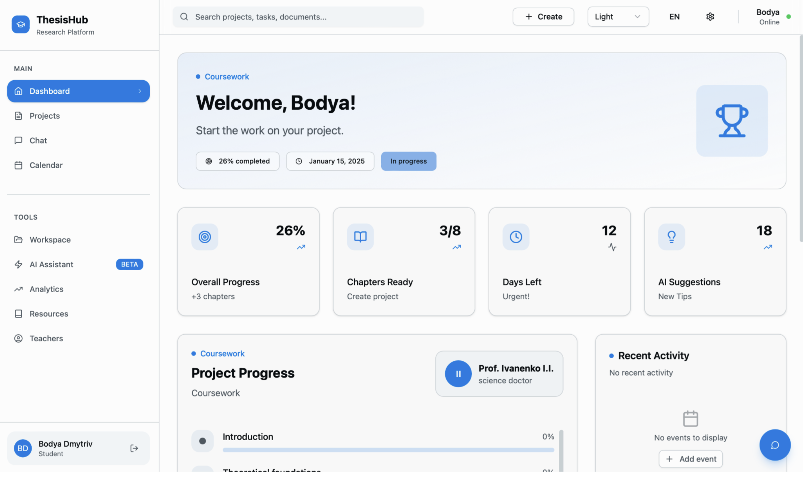
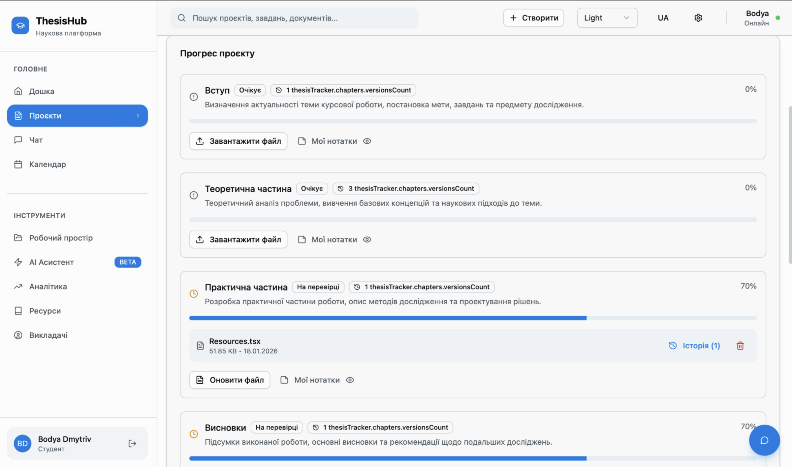
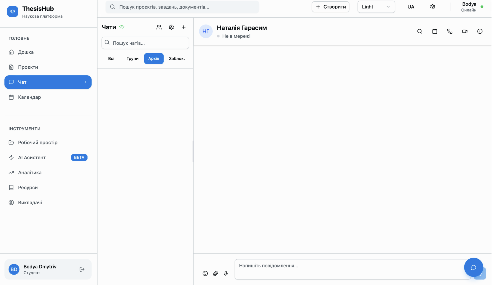
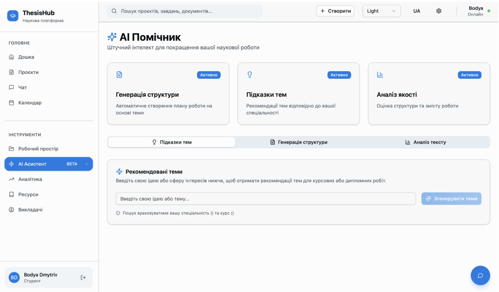
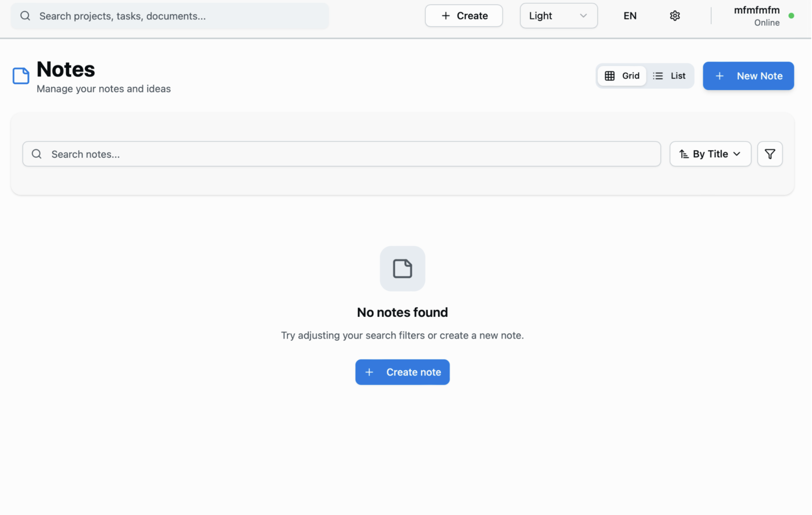
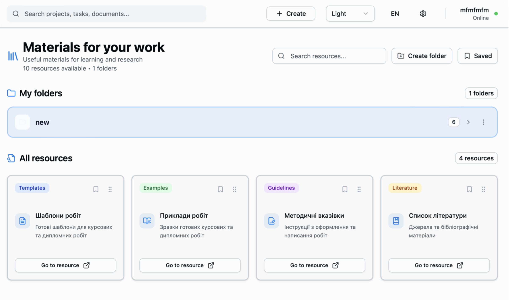

# 📘 Проєктування та реалізація функціоналу студентської ролі у вебсистемі менеджменту виконання курсових робіт

> *Інформаційна система для автоматизації повного циклу виконання курсових та дипломних робіт у закладах вищої освіти.*

---

## 👤 Автор

- **ПІБ**: Особа Вікторія Богданівна
- **Група**: ФЕІ-44
- **Керівник**: Бойко Ярослав Василькович, к.ф.-м.н., доцент
- **Дата виконання**: червень 2026 р.

---

## 📌 Загальна інформація

- **Тип проєкту**: Вебсистема (Three-tier web application)
- **Мова програмування**: TypeScript / JavaScript
- **Фреймворки / Бібліотеки**:
  - **Frontend**: React 18, TypeScript, Vite, Tailwind CSS, shadcn/ui
  - **Backend**: Node.js, Express.js, WebSocket (ws)
  - **Database**: PostgreSQL 15, node-postgres (pg)

---

## 🧠 Опис функціоналу (Студентська роль)

### 🔐 Автентифікація та профіль
- Реєстрація студента з академічними даними (факультет, спеціальність, група)
- Вхід за email/паролем з JWT-токеном
- Відновлення паролю через email
- Редагування профілю (bio, телефон, LinkedIn, GitHub)

### 📊 Панель керування (Dashboard)
- Вітальний банер з прогресом проєкту
- Статистичні картки (прогрес %, розділи, дні до дедлайну)
- Список розділів зі статусами
- Найближчі події з календаря
- AI-рекомендації (поради, автооновлення кожні 10-15 хв)

### 🤖 AI-асистент
- **Теми**: генерація тем на основі ідеї студента
- **Пошук викладачів**: автоматичний підбір керівника за навичками
- **Структура**: генерація структури роботи за темою
- **Аналіз тексту**: перевірка якості написання (читабельність, логіка, словниковий запас)

### 📁 Трекер розділів (ThesisTracker)
- Вибір типу проєкту (дипломна/курсова/практика)
- Завантаження файлів з автоматичним версіонуванням
- Надсилання розділу на перевірку керівнику
- Перегляд коментарів викладача
- Історія версій файлів
- Особисті нотатки до кожного розділу

### 💬 Чат (WebSocket)
- Приватні чати з науковим керівником
- Текстові, файлові та голосові повідомлення
- Відповіді на повідомлення
- Статуси прочитання (sent/delivered/read)
- Пошук історії повідомлень

### 📚 Ресурси та нотатки
- Перегляд навчальних матеріалів
- Збереження в закладки
- Організація ресурсів у власні папки (drag-and-drop)
- Персональні нотатки з Markdown-редактором

### 📅 Календар подій
- Додавання/редагування подій (дедлайни, зустрічі, завдання)
- Кольорове кодування типів подій
- Відображення в блоці активності дашборду

### 📊 Аналітика
- Персональна статистика активності
- Динаміка прогресу
- Часові графіки роботи

---

## 🧱 Опис основних файлів / модулів

### Серверна частина (server/)

| Файл | Призначення |
|------|-------------|
| `index.ts` | Точка входу, ініціалізація Express та WebSocket |
| `routes.ts` | Центральна реєстрація 17 модулів маршрутів |
| `db.ts` | Пул з'єднань PostgreSQL |
| `middleware/auth.ts` | JWT-верифікація |
| `routes/auth.routes.ts` | Автентифікація та логін |
| `routes/chapters.routes.ts` | Управління розділами, файлами, версіями |
| `routes/student.routes.ts` | Профіль, заявки, цілі, досягнення |
| `routes/chat.routes.ts` | REST-частина чату |
| `routes/ai.routes.ts` | AI-асистент (генерація тем, структури, аналіз) |
| `routes/analytics.routes.ts` | Аналітика активності |
| `routes/resources.routes.ts` | Навчальні ресурси |
| `routes/notes.routes.ts` | Нотатки (CRUD) |
| `routes/events.routes.ts` | Календар подій |

### Клієнтська частина (client/src/)

| Файл | Призначення |
|------|-------------|
| `App.tsx` | Головний компонент, маршрутизація |
| `pages/Login.tsx` | Сторінка входу (glassmorphism) |
| `pages/Index.tsx` | Панель керування студента |
| `pages/ThesisTracker.tsx` | Трекер розділів |
| `pages/Chat.tsx` | Веб-чат з WebSocket |
| `pages/AIAssistant.tsx` | AI-асистент |
| `pages/ProfilePage.tsx` | Профіль студента |
| `pages/NotesPage.tsx` | Нотатки (Markdown редактор) |
| `pages/Resources.tsx` | Ресурси з папками |
| `pages/Calendar.tsx` | Календар подій |
| `pages/Analytics.tsx` | Аналітика |

---

## 🗄️ Схема бази даних (основні таблиці)

| Таблиця | Призначення |
|---------|-------------|
| `users` | Користувачі (студенти/викладачі) |
| `faculties`, `departments`, `specialties`, `groups` | Довідники академічної структури |
| `user_projects` | Активний тип проєкту студента |
| `user_chapters` | Розділи роботи з прогресом |
| `file_versions` | Версії завантажених файлів |
| `teacher_comments` | Коментарі викладача до розділів |
| `student_topics` | Заявки на теми |
| `student_applications` | Заявки на керівництво |
| `chat_messages` | Повідомлення чату |
| `notifications` | Сповіщення користувачів |
| `resources` | Навчальні ресурси |
| `notes` | Нотатки користувачів |
| `events` | Календарні події |
| `writing_statistics` | Статистика активності |

---

## ▶️ Як запустити проєкт "з нуля"

### 1. Встановлення інструментів

- **Node.js** v18.0+
- **npm** v9.0+
- **PostgreSQL** v14+ (або Docker)
- **(Опціонально)** Docker v24.0+ + Docker Compose v2.0+


### 2. Варіант А: Розгортання через Docker Compose (рекомендований)

```bash
# Зібрати та запустити всі контейнери
docker compose up --build -d

# Перевірити стан
docker compose ps

# Переглянути логи
docker compose logs -f
```

Система доступна за адресою: **http://localhost:3000**

### 3. Варіант Б: Розгортання без Docker

#### 3.1 Налаштування бази даних

```bash
# Увійти до psql
psql -U postgres

# Створити користувача та базу даних
CREATE USER vikaosoba WITH PASSWORD 'your_password';
CREATE DATABASE Diplom OWNER vikaosoba;
GRANT ALL PRIVILEGES ON DATABASE Diplom TO vikaosoba;
\q

# Застосувати схему
psql -U vikaosoba -d Diplom -f init.sql
```

#### 3.2 Налаштування змінних середовища

Створіть файл `.env` у директорії `server/`:

```env
PORT=4000
DB_USER=vikaosoba
DB_PASSWORD=password
DB_NAME=Diplom
JWT_SECRET=secret_key
CLIENT_URL=http://localhost:5173
```

#### 3.3 Збірка та запуск

```bash
# Встановлення залежностей та збірка клієнта
cd client
npm install
npm run build

# Встановлення залежностей та запуск сервера
cd ../server
npm install
npm run dev
```

Система доступна за адресою, вказаною у виводі консолі (`http://localhost:4000`)

---

## 🔌 API приклади

### 🔐 Автентифікація

**POST /api/login**

```json
{
  "email": "student@lnu.edu.ua",
  "password": "password123",
  "role": "student"
}
```

**Response:**

```json
{
  "message": "Login successful",
  "token": "jwt_token_here",
  "user": {
    "id": 1,
    "firstName": "Вікторія",
    "lastName": "Особа",
    "email": "student@lnu.edu.ua",
    "role": "student"
  }
}
```

### 📁 Розділи роботи

**GET /api/user-chapters?projectType=diploma**

Отримати всі розділи з прогресом, коментарями та файлами.

**POST /api/user-chapters/:chapterKey/upload**

Завантажити файл до розділу (multipart/form-data).

**Response:**

```json
{
  "message": "File uploaded successfully",
  "chapter": {
    "progress": 70,
    "status": "review"
  },
  "file": {
    "name": "chapter_1_v2.docx",
    "size": "245 KB",
    "version": 2
  }
}
```

### 🤖 AI-асистент

**POST /api/ai/generate-topics**

```json
{
  "idea": "Веб-додаток для відстеження прогресу навчання студентів"
}
```

**Response:**

```json
{
  "topics": [
    {
      "title": "Архітектура системи відстеження навчального прогресу",
      "description": "Технічні аспекти розробки системи моніторингу успішності",
      "category": "Технічна реалізація"
    }
  ]
}
```

### 💬 Чат (WebSocket)

Підключення:
```
ws://localhost:4000/ws?token=<JWT_TOKEN>
```

Типи повідомлень:
- `auth` — автентифікація
- `chat_list` — отримання списку чатів
- `message` — відправка/отримання повідомлення
- `typing` — індикатор набору тексту
- `read_receipt` — підтвердження прочитання
- `user_status` — статус онлайн/офлайн

---

## 🖱️ Інструкція для користувача (Студент)

### 1. Реєстрація та вхід
1. Перейдіть на головну сторінку системи
2. Натисніть «Зареєструватись»
3. Заповніть форму: ПІБ, email, пароль, виберіть факультет, спеціальність, групу
4. Після реєстрації увійдіть з email та паролем
5. Оберіть роль «Студент»

### 2. Панель керування (Dashboard)
- Перегляньте загальний прогрес проєкту
- Ознайомтеся з AI-рекомендаціями (оновлюються кожні 15 хв)
- Перейдіть до трекера розділів через кнопку «Детальний перегляд»

### 3. Трекер розділів
1. При першому відкритті оберіть тип проєкту (дипломна/курсова/практика)
2. Для кожного розділу:
   - Натисніть «Завантажити файл» → оберіть файл (.docx, .pdf, .xlsx)
   - Додайте нотатки (іконка 📝)
   - Після завершення натисніть «Надіслати на перевірку»
   - Переглядайте коментарі викладача (іконка 💬)
   - Переглядайте історію версій файлів (іконка 🕒)

### 4. AI-асистент
1. Перейдіть до розділу «AI-асистент»
2. **Вкладка «Теми»**: опишіть ідею → отримайте 3-5 варіантів тем
3. Для обраної теми натисніть «Знайти викладачів» → оберіть керівника
4. Заповніть форму заявки (опис, цілі, вимоги)
5. **Вкладка «Структура»**: введіть тему → отримайте структуру роботи
6. **Вкладка «Аналіз»**: вставте текст → отримайте аналіз якості

### 5. Чат з керівником
1. Перейдіть до «Чат»
2. Оберіть чат зі списку ліворуч
3. Надсилайте текстові повідомлення, файли або голосові
4. Використовуйте реакції 👍, ❤️ тощо
5. Відповідайте на конкретні повідомлення

### 6. Профіль та ресурси
- **Профіль**: редагуйте bio, телефон, посилання на LinkedIn/GitHub
- **Ресурси**: переглядайте матеріали викладача, додавайте в закладки, створюйте папки
- **Нотатки**: створюйте особисті нотатки з Markdown-форматуванням
- **Календар**: додавайте події та відстежуйте дедлайни

### 7. Вихід
- Натисніть на аватар у правому верхньому куті
- Виберіть «Вийти»

---

## 📷 Приклади / скриншоти

## 📷 Скріншоти системи

### 1. Панель керування (Dashboard)

*Головна сторінка з прогресом проєкту та AI-рекомендаціями*

### 2. Трекер розділів

*Управління розділами, завантаження файлів та версіонування*

### 3. Чат з керівником

*Реалізовано WebSocket, статуси прочитання та голосові повідомлення*

### 4. AI-асистент

*Генерація тем, пошук викладачів та аналіз тексту*

### 5. Особисті нотатки

*Markdown-редактор для створення нотаток*

### 6. Навчальні ресурси

*Навчальні ресурси з папками та drag-and-drop*

---
> 💡 **Всі скріншоти зроблені в реальному часі роботи системи**

---

## 🧪 Проблеми і рішення

| Проблема | Рішення |
|----------|---------|
| Не зберігаються файли | Перевірити права на директорію `uploads/` |
| WebSocket не підключається | Перевірити токен у query-параметрі `?token=` |
| JWT токен прострочено | Реалізовано автоматичне перенаправлення на /login |
| SQL-ін'єкції | Використання параметризованих запитів pg ($1, $2, ...) |
| 403 Forbidden | Перевірити роль у JWT-middleware |
| Версії файлів не відображаються | Перевірити таблицю `file_versions` та зв'язок з `user_chapters` |

---

## 🧾 Використані джерела / література

1. React Documentation – [https://react.dev](https://react.dev)
2. TypeScript Documentation – [https://www.typescriptlang.org/docs](https://www.typescriptlang.org/docs)
3. Node.js Documentation – [https://nodejs.org/en/docs](https://nodejs.org/en/docs)
4. Express.js Documentation – [https://expressjs.com](https://expressjs.com)
5. PostgreSQL 16 Documentation – [https://www.postgresql.org/docs/16/](https://www.postgresql.org/docs/16/)
6. Node-postgres (pg) – [https://node-postgres.com](https://node-postgres.com)
7. Docker Documentation – [https://docs.docker.com](https://docs.docker.com)
8. Moodle Documentation – [https://docs.moodle.org](https://docs.moodle.org)
9. Canvas LMS – [https://www.instructure.com/canvas](https://www.instructure.com/canvas)
10. Trello Product Overview – [https://trello.com](https://trello.com)
11. JWT Overview – [https://highload.tech/uk/plyusy-i-minusy-jwt-kratkij-obzor/](https://highload.tech/uk/plyusy-i-minusy-jwt-kratkij-obzor/)
12. AI and the Future of Universities – [https://www.hepi.ac.uk](https://www.hepi.ac.uk/wp-content/uploads/2025/10 AI-and-the-Future-of-Universities.pdf)